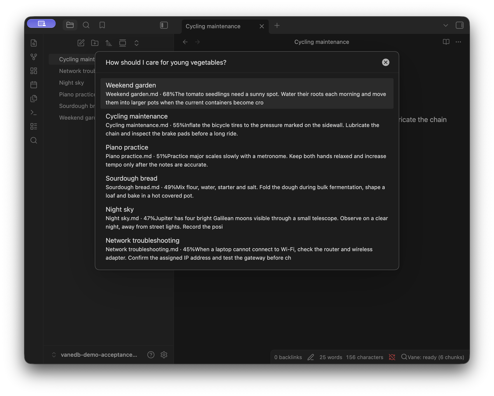

# Vane Search 0.2.0 desktop acceptance

**Result: PASS for the tested candidate.** On September 23, 2026, the real
Obsidian application and a local Ollama model completed connection, indexing,
semantic search, opening a result, full app restart, edit, and deletion checks.
The run finished at 20:48:50 UTC in an isolated vault containing only the six
[synthetic fixture notes](fixtures/0.2.0/). These are observations from one
fixture and model, not a benchmark or a guarantee of ranking on other vaults.

## Tested identity

| Item | Value |
| --- | --- |
| Demo version | 0.2.0 |
| Demo source commit | [`ab598838d300279191c306c1df8649a9ea947b95`](https://github.com/vanedb/obsidian-vane-search/commit/ab598838d300279191c306c1df8649a9ea947b95) |
| Installed `main.js` SHA-256 | `b26ba7c78a116ea865c0262a89b2ef17f27fdda7eb95e67504ac6a3aeca49092` |
| Bundled engine | Published, exact-pinned `@vanedb/wasm` 0.1.1 |
| Host | macOS 27.0, ARM64 |
| Obsidian | 1.13.7 |
| Ollama | 0.34.2 |
| Embedding model | `nomic-embed-text:latest` |
| Model digest | `0a109f422b47e3a30ba2b10eca18548e944e8a23073ee3f3e947efcf3c45e59f` |
| Embedding dimensions | 768 |
| Endpoint | `http://localhost:11434/v1`, no API key |
| Vault | Six synthetic Markdown notes; six indexed chunks |

The installed bundle checksum was rechecked against the source build after
the walkthrough. The demo version and engine version are independent. This
run did not exercise engine 0.2.0 or publish the demo. Any separate test with
an engine 0.2.0 candidate tarball is outside this desktop acceptance record.

## Observed walkthrough

1. Opened the isolated vault in Obsidian, enabled the reviewed Vane Search
   build, and selected **Ollama · nomic-embed-text (English)** in settings.
2. Used **Test connection**. A **Connected** toast appeared in the main vault
   window after closing Settings.
3. Ran **Vane Search: Index new and changed notes** from the command palette.
   Progress reached **Vane: ready (6 chunks)**.
4. Ran **Vane Search: Search vault semantically** with the README query:
   **How should I care for young vegetables?**

| Rank | Note | Displayed score |
| --- | --- | --- |
| 1 | Weekend garden | 68% |
| 2 | Cycling maintenance | 55% |
| 3 | Piano practice | 51% |
| 4 | Sourdough bread | 49% |
| 5 | Night sky | 47% |
| 6 | Network troubleshooting | 45% |

The percentages above are the scores displayed by the plugin, not measured
accuracy or confidence. Pressing Return on the first result opened Weekend
garden with its original fixture text.

On September 24, 2026, at 05:44:18 UTC, the original query was rechecked in
Obsidian and returned the same six results and displayed scores, with
**Vane: ready (6 chunks)**. The installed `main.js` checksum still matched
the accepted bundle above. This follow-up reconfirmed the query; the full
restart, edit, and deletion walkthrough remains the September 23 run.

The screenshot contains only the synthetic fixture vault and is attached here
for review:



Screenshot SHA-256:
`b66caa50a2f6120d28ae831d7911db47d4d33c2efe0a1f33b815a58a2f73e437`.

## Restart, edit, and deletion

**Restart:** Quit Obsidian with Command-Q, confirmed the app quit, then
relaunched it and selected the test vault. The status was ready with six
chunks. Without running the indexing command, the original query returned
the same six results and scores, and selecting Weekend garden opened the
correct note.

**Edit:** Replaced Weekend garden's content in the Obsidian editor and saved:

```markdown
# Weekend garden

The solar irrigation controller uses an emergency backup battery. Recharge that battery every Friday and inspect its cable connections.
```

Without manual reindexing, the query **When should I recharge the solar
irrigation controller's backup battery?** returned Weekend garden first at
85%, showing the updated snippet. The index still reported six chunks.

**Deletion:** The query **How can I observe Jupiter's Galilean moons?** first
returned Night sky at 85%. Deleted that synthetic note through Obsidian's
file menu, confirming the dialog that moved it to system trash. The index
then reported five chunks, and repeating the same query returned the other
five notes with Night sky absent.

**Restore:** Restored the original Weekend garden and Night sky fixture files
after the checks. The UI returned to six ready chunks and the original
vegetables query again produced the original six results and scores.

## Release boundary

This record accepts the source and installed bundle identified above. It
neither records an official GitHub release nor accepts an untested replacement
bundle. Before tagging the final reviewed merge, rebuild it and compare the
`main.js` SHA-256 with this record. If the bundle changes, repeat the desktop
walkthrough and update its identity and observations. Required CI, independent
review, and the official release assets remain separate gates in the
[release checklist](0.2.0.md).

Mobile, other providers, other models, and larger or personal vaults were not
part of this run.
